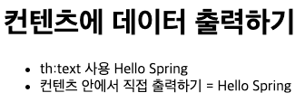
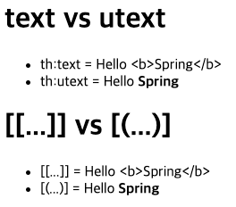

# 타임리프 - 기본 기능
## 프로젝트 생성
`src/main/resources/static/index.html`
```html
<html>
<head>
    <meta charset="UTF-8">
    <title>Title</title>
</head>
<body>
<ul>
    <li>텍스트
        <ul>
            <li><a href="/basic/text-basic">텍스트 출력 기본</a></li>
            <li><a href="/basic/text-unescaped">텍스트 text, utext</a></li>
        </ul>
    </li>
    <li>표준 표현식 구문
        <ul>
            <li><a href="/basic/variable">변수 - SpringEL</a></li>
            <li><a href="/basic/basic-objects?paramData=HelloParam">기본 객체들</
                a></li>
            <li><a href="/basic/date">유틸리티 객체와 날짜</a></li>
            <li><a href="/basic/link">링크 URL</a></li>
            <li><a href="/basic/literal">리터럴</a></li>
            <li><a href="/basic/operation">연산</a></li>
        </ul>
    </li>
    <li>속성 값 설정
        <ul>
            <li><a href="/basic/attribute">속성 값 설정</a></li>
        </ul>
    </li>
    <li>반복
        <ul>
            <li><a href="/basic/each">반복</a></li>
        </ul>
    </li>
    <li>조건부 평가
        <ul>
            <li><a href="/basic/condition">조건부 평가</a></li>
        </ul>
    </li>
    <li>주석 및 블록
        <ul>
            <li><a href="/basic/comments">주석</a></li>
            <li><a href="/basic/block">블록</a></li>
        </ul>
    </li>
    <li>자바스크립트 인라인
        <ul>
            <li><a href="/basic/javascript">자바스크립트 인라인</a></li>
        </ul>
    </li>
    <li>템플릿 레이아웃
        <ul>
            <li><a href="/template/fragment">템플릿 조각</a></li>
            <li><a href="/template/layout">유연한 레이아웃</a></li>
            <li><a href="/template/layoutExtend">레이아웃 상속</a></li>
        </ul>
    </li>
</ul>
</body>
</html>
```

## 타임리프 소개
* 공식 사이트: https://www.thymeleaf.org/
* 공식 메뉴얼 - 기본 기능: https://www.thymeleaf.org/doc/tutorials/3.0/usingthymeleaf.html
* 공식 메뉴얼 - 스프링 통합: https://www.thymeleaf.org/doc/tutorials/3.0/thymeleafspring.html

타임 리프의 개념은 간단히 소개하고, 실제 동작하는 기본 기능 위주로 알아보겠다.

### 타임리프 특징
* 서버 사이드 HTML 렌더링 (SSR)
* 네튜얼 템플릿
* 스프링 통합 지원

### 서버 사이드 HTML 렌더링 (SSR)
타임리프는 백엔드 서버에서 HTML을 동적으로 렌더링하는 용도로 사용된다.

### 네츄럴 템플릿
타임리프는 순수 HTML을 최대한 유지하는 특징이 있다.
타임리프로 작성한 파일은 HTML을 유지하기 때문에 웹 브라우저에서 파일을 직접 열어도 내용을 확인할 수 있고,
서버를 통해 뷰 템플릿을 거치면 동적으로 변경된 결과를 확인할 수 있다.

### 스프링 통합 지원
타임리프는 스프링과 자연스럽게 통합되고, 스프링의 다양한 기능을 편리하게 사용할 수 있게 지원한다.

## 텍스트 - text, utext
### 타임리프 사용 선언
`<html xmlns:th="http://www.thymeleaf.org">`

타임리프는 기본적으로 HTML 태그의 속성에 기능을 정의해서 동작한다.
`<span th:text="${data}>`

### BasicController
```java
@Controller
@RequestMapping("/basic")
public class BasicController {
    @GetMapping("text-basic")
    public String textBasic(Model model) {
        model.addAttribute("data", "Hello Spring");
        return "basic/text-basic";
    }
}
```

### text-basic.html
```html
<!DOCTYPE html>
<html lang="ko" xmlns:th="http://www.thymeleaf.org">
<head>
    <meta charset="UTF-8">
    <title>Title</title>
</head>
<body>
    <h1>컨텐츠에 데이터 출력하기</h1>
    <ul>
        <li>th:text 사용 <span th:text="${data}"></span> </li>
        <li>컨텐츠 안에서 직접 출력하기 = [[${data}]]</li>
    </ul>
</body>
</html>
```



### Escape
HTML 문서는 `<>` 같은 특수 문자를 기반으로 정의된다.
따라서 뷰 템플릿으로 HTML 화면을 생성할 때는 출력하는 데이터에 이러한 특수 문자가 있는 것을 주의해서 사용해야 한다.

웹 브라우저는 `<` 를 HTML 태그의 시작으로 인식한다.
따라서 `<`를 문자로 표현하기 위해서, 별개의 특수 문자를 HTML 엔티티로 변경하는 작업이 필요하다.

타임리프가 제공하는 `th:text`, `[[...]]`는 기본적으로 Escape로 동작한다.

### Unescape
타임리프가 Escape 기능을 사용하지 않게 하려면 아래의 코드를 작성하면 된다.
* `th:text` -> `th:utext`
* `[[...]]` -> `[(...)]`

### BasicController
```java
@Controller
@RequestMapping("/basic")
public class BasicController {
    @GetMapping("text-unescaped")
    public String textUnescaped(Model model) {
        model.addAttribute("data", "Hello <b>Spring</b>");
        return "basic/text-unescape";
    }
}
```

### text-unescape.html
```html
<!DOCTYPE html>
<html lang="ko" xmlns:th="http://www.thymeleaf.org">
<head>
    <meta charset="UTF-8">
    <title>Title</title>
</head>
<body>
<h1>text vs utext</h1>
<ul>
    <li>th:text = <span th:text="${data}"></span></li>
    <li>th:utext = <span th:utext="${data}"></span></li>
</ul>

<h1><span th:inline="none"> [[...]] vs [(...)] </span></h1>
<ul>
    <li><span th:inline="none">[[...]] = </span> [[${data}]]</li>
    <li><span th:inline="none">[(...)] = </span> [(${data})] </li>
</ul>
</body>
</html>
```
* `th:inline="none"`: 해당 태그 안의 글자는 타임리프가 해석하지 말라는 뜻이다. 



> 주의!<br>
> 실제 서비스를 개발하다 보면 escape를 사용하지 않아서 HTML이 정상 렌더링 되지 않는 수 많은 문제가 발생한다.
> escape를 기본으로 하고, 꼭 필요할 때만 unescape를 사용하자.

## 변수 - SpringEL
타임 리프에서 변수를 사용할 때는 변수 표현식을 사용한다. `${...}`

그리고 이 변수 표현식에는 SpringEL 이라는 스프링이 제공하는 표현식을 사용할 수 있다.

### BasicController
```java
@Controller
@RequestMapping("/basic")
public class BasicController {
    @Getter @Setter
    static class User {
        private String username;
        private int age;

        public User(String username, int age) {
            this.username = username;
            this.age = age;
        }
    }

    @GetMapping("/variable")
    public String variable(Model model) {
        User userA = new User("userA", 10);
        User userB = new User("userB", 20);

        List<User> list = new ArrayList<>();
        list.add(userA);
        list.add(userB);

        Map<String, User> map = new HashMap<>();
        map.put("userA", userA);
        map.put("userB", userB);

        model.addAttribute("user", userA);
        model.addAttribute("users", list);
        model.addAttribute("userMap", map);

        return "basic/variable";
    }
}
```

### variable.html
```html
<!DOCTYPE html>
<html lang="ko" xmlns:th="http://www.thymeleaf.org">
<head>
    <meta charset="UTF-8">
    <title>Title</title>
</head>
<body>
<h1>SpringEL 표현식</h1>
<ul> Object
    <li>${user.username} = <span th:text="${user.username}"></span></li>
    <li>${user['username']} = <span th:text="${user['username']}"></span></li>
    <li>${user.getUsername()} = <span th:text="${user.getUsername()}"></span></li>
</ul>

<ul> List
    <li>${users[0].username} = <span th:text="${users[0].username}"></span></li>
    <li>${users[0]['username']} = <span th:text="${users[0]['username']}"></span></li>
    <li>${users[0].getUsername()} = <span th:text="${users[0].getUsername()}"></span></li>
</ul>

<ul> Map
    <li>${userMap['userA'].username} = <span th:text="${userMap['userA'].username}"></span></li>
    <li>${userMap['userA']['username']} = <span th:text="${userMap['userA']['username']}"></span></li>
    <li>${userMap['userA'].getUsername()} = <span th:text="${userMap['userA'].getUsername()}"></span></li>
</ul>
</body>
</html>
```

### 지역 변수 선언 - th:with
```html
<!DOCTYPE html>
<html lang="ko" xmlns:th="http://www.thymeleaf.org">
<head>
    <meta charset="UTF-8">
    <title>Title</title>
</head>
<body>
    <h1> 지역 변수 - {th:with} </h1>
    <div th:with="first=${users[0]}">
        <p>처음 사람의 이름은 <span th:text="${first.username}"></span></p>
    </div>
</body>
</html>
```

## 기본 객체들
### BasicController
```java
@Controller
@RequestMapping("/basic")
public class BasicController {
    @Component("helloBean")
    static class HelloBean {
        public String hello(String data) {
            return "Hello " + data;
        }
    }

    @GetMapping("/basic-objects")
    public String basicObjects(
            Model model,
            HttpServletRequest req,
            HttpServletResponse resp,
            HttpSession session
    ) {
        session.setAttribute("sessionData", "Hello Session");
        model.addAttribute("request", req);
        model.addAttribute("response", resp);
        model.addAttribute("servletContext", req.getServletContext());
        return "basic/basic-objects";
    }
}
```

### basic-objects.html
```html
<!DOCTYPE html>
<html lang="ko" xmlns:th="http://www.thymeleaf.org">
<head>
    <meta charset="UTF-8">
    <title>Title</title>
</head>
<body>
    <h1>식 기본 객체 (Expression Basic Object)</h1>
    <ul>
        <li>request = <span th:text="${request}"></span></li>
        <li>response = <span th:text="${response}"></span></li>
        <li>session = <span th:text="${session}"></span></li>
        <li>servletContext = <span th:text="${servletContext}"></span></li>
        <li>locale = <span th:text="${#locale}"></span></li>
    </ul>

    <h1>편의 객체</h1>
    <ul>
        <li>Request Parameter = <span th:text="${param.paramData}"></span></li>
        <li>session = <span th:text="${session.sessionData}"></span></li>
        <li>spring bean = <span th:text="${@helloBean.hello('Spring!')}"></span></li>
    </ul>
</body>
</html>
```

### 편의 객체들
* HTTP 요청 파라미터 접근: `param` 
  * `${param.paramData}`
* HTTP 세션 접근: `session`
  * `${session.sessionData}`
* 스프링 빈 접근: `@`
  * `${@helloBean.hello('Spring')}`
* 국가: `${#locale}`

## 유틸리티 객체와 날짜
### 타임리프 유틸리티 객체, 예시
- https://www.thymeleaf.org/doc/tutorials/3.0/usingthymeleaf.html#expression-utility-objects
- https://www.thymeleaf.org/doc/tutorials/3.0/usingthymeleaf.html#appendix-b-expression-utility-objects

### BasicController
```java
@Controller
@RequestMapping("/basic")
public class BasicController {
  @GetMapping("/date")
  public String date(Model model) {
    model.addAttribute("localDateTime", LocalDateTime.now());
    return "basic/date";
  }
}
```

### date.html
```html
<!DOCTYPE html>
<html lang="ko" xmlns:th="http://www.thymeleaf.org"></html>
<head>
    <meta charset="UTF-8">
    <title>Title</title>
</head>
<body>
    <h1>LocalDateTime</h1>
    <ul>
        <li> default = <span th:text="${localDateTime}"></span></li>
        <li> 
            yyyy-MM-dd HH:mm:ss = 
            <span th:text="${#temporals.format(localDateTime, 'yyyy-MM-dd HH:mm:ss')}"></span>
        </li>
    </ul>

    <h1>LocalDateTime - Utils</h1>
    <ul>
        <li>
            ${#temporals.day(localDateTime)} = 
            <span th:text="${#temporals.day(localDateTime)}"></span>
        </li>
        <li>
            ${#temporals.month(localDateTime)} = 
            <span th:text="${#temporals.month(localDateTime)}"></span>
        </li>
        <li>
            ${#temporals.monthName(localDateTime)} = 
            <span th:text="${#temporals.monthName(localDateTime)}"></span>
        </li>
        <li>
            ${#temporals.monthNameShort(localDateTime)} = 
            <span th:text="${#temporals.monthNameShort(localDateTime)}"></span>
        </li>
        <li>
            ${#temporals.year(localDateTime)} = 
            <span th:text="${#temporals.year(localDateTime)}"></span>
        </li>
        <li>
            ${#temporals.dayOfWeek(localDateTime)} = 
            <span th:text="${#temporals.dayOfWeek(localDateTime)}"></span>
        </li>
        <li>
            ${#temporals.dayOfWeekName(localDateTime)} = 
            <span th:text="${#temporals.dayOfWeekName(localDateTime)}"></span>
        </li>
        <li>
            ${#temporals.dayOfWeekNameShort(localDateTime)} = 
            <span th:text="${#temporals.dayOfWeekNameShort(localDateTime)}"></span>
        </li>
        <li>
            ${#temporals.hour(localDateTime)} =
            <span th:text="${#temporals.hour(localDateTime)}"></span>
        </li>
        <li>
            ${#temporals.minute(localDateTime)} = 
            <span th:text="${#temporals.minute(localDateTime)}"></span>
        </li>
        <li>
            ${#temporals.second(localDateTime)} = 
            <span th:text="${#temporals.second(localDateTime)}"></span>
        </li>
        <li>
            ${#temporals.nanosecond(localDateTime)} =
            <span th:text="${#temporals.nanosecond(localDateTime)}"></span>
        </li>
    </ul>
</body>
</html>
```

## URL 링크
### BasicController
```java
@Controller
@RequestMapping("/basic")
public class BasicController {
  @GetMapping("/link")
  public String link(Model model) {
    model.addAttribute("param1", "data1");
    model.addAttribute("param2", "data2");
    return "basic/link";
  }
}
```

### link.html
```html
<!DOCTYPE html>
<html lang="ko" xmlns:th="http://www.thymeleaf.org"></html>
<head>
    <meta charset="UTF-8">
    <title>Title</title>
</head>
<body>
    <h1>URL 링크</h1>
    <ul>
        <li>
            <a th:href="@{/hello}">basic url</a>
        </li>
        <li>
            <a th:href="@{/hello(param1=${param1}, param2=${param2})}">hello query param</a>
        </li>
        <li>
            <a th:href="@{/hello/{param1}/{param2}(param1=${param1}, param2=${param2})}">path variable</a>
        </li>
        <li>
            <a th:href="@{/hello/{param1}(param1=${param1}, param2=${param2})}">
                path variable + query parameter
            </a>
        </li>
    </ul>
</body>
</html>
```

### 표현식 정리
* `@{/hello}` -> /hello
* `@{hello}` -> /basic/link/hello
* `@{/hello(param1=${param1}, param2=${param2})}` -> /hello?param1=data1&param2=data2
* `@{/hello/{param1}(param1=${param1}, param2=${param2})}` -> /hello/data1?param2=data2

### 주의! 외부에서 사용된 변수는 쿼리 파라미터에 포함되지 않는다!
3번과 4번을 보면 알 수 있겠지만, `()`부분은 경로 변수로 처리된다. 
그런데, 4번을 보면, param1은 `()`외부에서 사용되었고, param2는 외부에서 사용되지 않았다.
그 결과, 외부에서 사용된 param1은 쿼리 파라미터에 포함되지 않게 되고 param2만 파라미터에 사용되어진다. 

## 리터럴
### BasicController
```java
@Controller
@RequestMapping("/basic")
public class BasicController {
  @GetMapping("literal")
  public String literal(Model model) {
    model.addAttribute("data", "Spring!");
    return "basic/literal";
  }
}
```

### literal.html
```html
<!DOCTYPE html>
<html lang="ko" xmlns:th="http://www.thymeleaf.org"></html>
<head>
    <meta charset="UTF-8">
    <title>Title</title>
</head>
<body>
    <h1>리터럴</h1>
    <ul>
        <li>
            'hello' + ' world!' =
            <span th:text="'hello' + ' world!'"></span>
        </li>
        <li>
            'hello world!' =
            <span th:text="'hello world!'"></span>
        </li>
        <li>
            'hello ' + ${data} = 
            <span th:text="'hello ' + ${data}"></span>
        </li>
        <li>
            리터럴 대체 |hello ${data}| =
            <span th:text="|hello ${data}|"></span>
        </li>
    </ul>
</body>
</html>
```

### Literal Substitutions
`<span th:text="|hello ${data}|"`

## 연산
### BasicController
```java
@Controller
@RequestMapping("/basic")
public class BasicController {
  @GetMapping("operation")
  public String operation(Model model) {
    model.addAttribute("nullData", null);
    model.addAttribute("data", "Spring");
    return "basic/operation";
  }
}
```

### operation.html
```html
<!DOCTYPE html>
<html lang="ko" xmlns:th="http://www.thymeleaf.org"></html>
<head>
    <meta charset="UTF-8">
    <title>Title</title>
</head>
<body>
    <ul>
        <li> 산술 연산
            <ul>
                <li> 10 + 2 = <span th:text="10 + 2"></span> </li>
                <li> 10 % 2 = <span th:text="10 % 2"></span> </li>
            </ul>
        </li>
        <li> 비교 연산
            <ul>
                <li> 1 > 10 = <span th:text="1 > 10"></span> </li>
                <li> 1 gt 10 = <span th:text="1 gt 10"></span> </li>
                <li> 1 >= 10 = <span th:text="1 >= 10"></span> </li>
                <li> 1 ge 10 = <span th:text="1 ge 10"></span> </li>
                <li> 1 == 10 = <span th:text="1 == 10"></span> </li>
                <li> 1 != 10 = <span th:text="1 != 10"></span> </li>
            </ul>
        </li>
        <li> 조건식
            <ul>
                <li>
                    ( 10 % 2 == 0 ) ? '짝수' : '홀수' =
                    <span th:text="( 10 % 2 == 0 ) ? '짝수' : '홀수'"></span>
                </li>
            </ul>
        </li>
        <li> Elvis 연산자
            <ul>
                <li>
                    ${data} ?: '데이터가 없습니다.' = 
                    <span th:text="${data} ?: '데이터가 없습니다.'"></span>
                </li>
                <li>
                    ${nullData} ?: '데이터가 없습니다.' = 
                    <span th:text="${nullData} ?: '데이터가 없습니다.'"></span>
                </li>
            </ul>
        </li>
        <li> No-Operation
            <ul>
                <li>
                    ${data} ?: _ = 
                    <span th:text="${data} ?: _"> 데이터가 없습니다. </span>
                </li>
                <li>
                    ${nullData} ?: _ =
                    <span th:text="${nullData} ?: _"> 데이터가 없습니다. </span>
                </li>
            </ul>
        </li>
    </ul>
</body>
</html>
```

## 속성 값 설정

## 반복

## 조건부 평가

## 주석

## 블록

## 자바스크립트 인라인

## 템플릿 조각

## 템플릿 레이아웃 1

## 템플릿 레이아웃 2

## 정리

